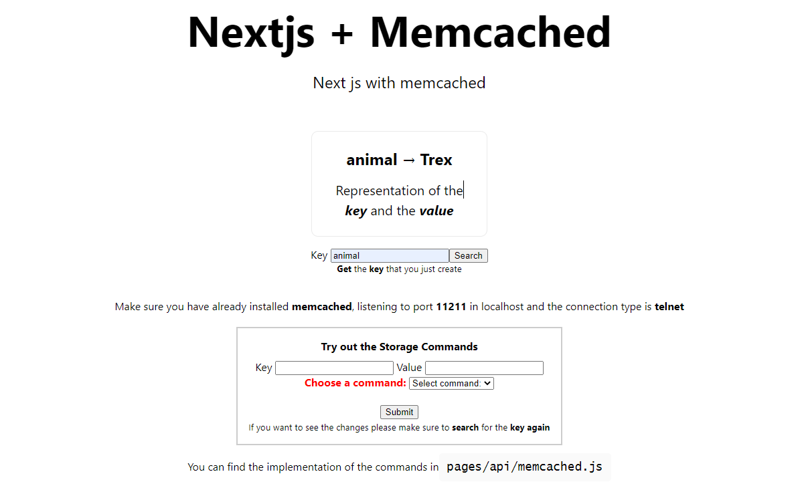

## Clone repository

```bash
git clone https://github.com/camila-barona1/Implement_Memcached.git
```

<div>

</div>

# Getting Started

First run the command on the folder where the project has been downloaded

```bash
npm install #make sure you have node js installed
```

to install all the dependencias from the package.json

Second, run the development server:

```bash
npm run dev
# or
yarn dev
```

Open [http://localhost:3000](http://localhost:3000) with your browser to see the result.

You can see the implementacion of all commands in `pages/api/memcached.js`.

# Requirements to start running the tests

- Have memcached installed

### Install Memcached on Windows

If you want to set up memcached on windows follow the next instructions [Install Memcached under Windows](https://www.programmersought.com/article/73161677171/).

Then install [PuTTY](https://www.putty.org/)

Make the configuration so hostmame is set to **localhost**, port is set to **11211** and connection type is **Telnet**.

### Install Memcached on Ubuntu

Run the commands on the terminal
`sudo apt-get install memcache`
then connet
`telnet localhost 11211`

# NOTES

- Make sure you first add or set a new value to a new or existing key by the syntax

```bash
add key flags exptime bytes
value
# or
set key flags exptime bytes
value

#so you can start getting keys
```

- Get the value that you create by pasing the key in the line 14 on the file `pages/api/memcached.js`.

### Example

```bash
set animal 0 3600 3 #set the key [animal]
cat #and pass it the value of cat
#go to pages/api/memcached.js and pass the key to the variable [key_get]
```

Now you just save the file and refresh the page to see the key and value displayed

- For more information of the commands this site is very helpful [memcached commands](https://www.tutorialspoint.com/memcached/memcached_add_data.htm)
